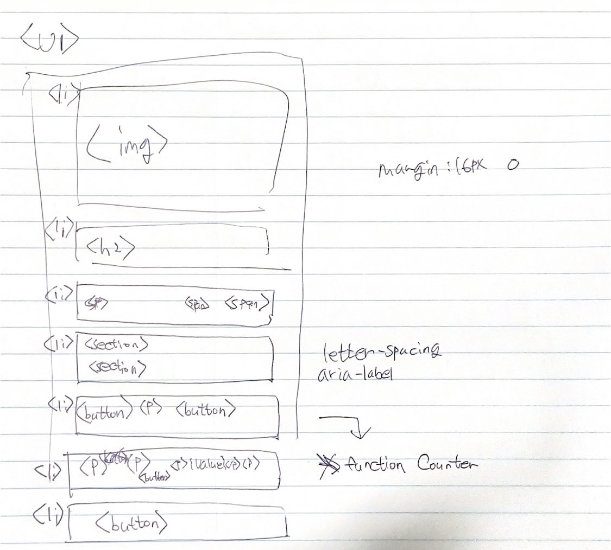
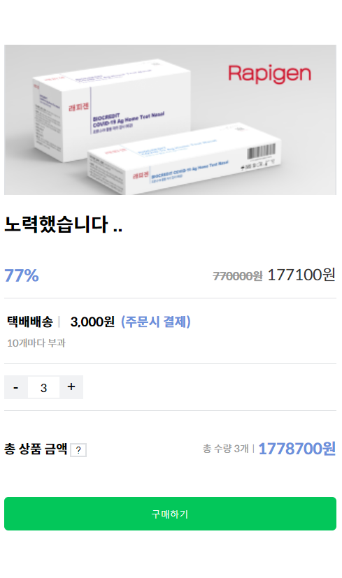
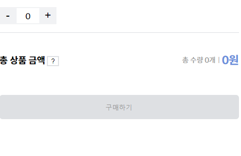
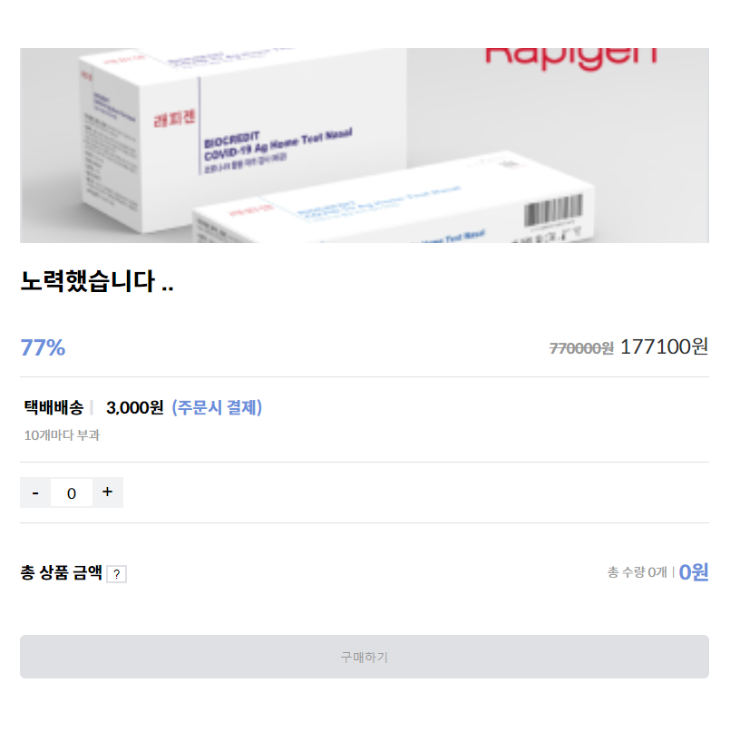

<a href="https://velog.io/@qwqq6954/%EB%A6%AC%EC%95%A1%ED%8A%B82%EC%A3%BC%EC%B0%A8-%EA%B3%BC%EC%A0%9C-%EB%B6%80%EC%85%94%EB%B3%B4%EC%9E%90#">벨로그에서 더 자세한 내용보기</a>

<h1>리액트 2주차 과제</h1>

제대로 확인 안하고, 깃 헙에 올린점 죄송합니다. 

CRA로 작업하여 stackBlitz으로 연동을 끝내 못해.. 이렇게라도 올립니다 

npm run 하고 확인가능합니다

<h2>마크업</h2>

<h2>최종화면</h2>

<h2>상품 수량 0 일 때 , disable 되는 블럭</h2>

<h2>반응형 </h2>

